<div align="center">

# 🛒 Multi-Vendor E-Commerce Platform

**MVEP** is an enterprise-grade React SPA featuring a dual-portal architecture — a full **Vendor Dashboard** and a **Customer Storefront** — with role-based access control, server-state management via RTK Query, and a multi-step checkout flow.

<br/>

[](https://react.dev)
[](https://redux-toolkit.js.org)
[](https://www.typescriptlang.org)
[](https://tailwindcss.com)
[](https://vitejs.dev)
[](https://vitest.dev)

<br/>

[**Live Demo →**](https://mvep.vercel.app) &nbsp;|&nbsp; [API Contract](./docs/api-contract.md) &nbsp;|&nbsp; [Test Cases](./docs/test-cases.md) &nbsp;|&nbsp; [Project Spec](./docs/project-spec.md)

</div>

---

## 📸 Screenshots

> _Add screenshots here once the UI is built. Suggested: Landing page, Vendor Dashboard with analytics chart, Product catalogue, Checkout flow._

---

## ✨ Features

### Vendor Dashboard (`/dashboard`)

- **Product management** — full CRUD with bulk actions, stock tracking, and low-inventory alerts
- **Order management** — status workflow (Pending → Processing → Shipped → Delivered), filterable order list
- **Analytics** — revenue charts (7d / 30d / 90d / 1y), top products, conversion funnel, CSV export

### Customer Storefront (`/shop`)

- **Product catalogue** — infinite scroll, real-time search with debounce, multi-criteria filtering (category, price range, rating, stock)
- **Shopping cart** — optimistic UI updates, quantity management, localStorage persistence
- **Multi-step checkout** — Delivery → Payment → Review → Confirmation with Zod validation at each step
- **Wishlist** — optimistic toggle, move-to-cart, dedicated wishlist page
- **Order history** — live status tracking per order

### Platform-wide

- 🔐 JWT authentication with three roles: **Customer**, **Vendor**, **Admin**
- 🛡️ Protected routes with role-based access guards
- 💀 Skeleton loaders on all async surfaces (no spinners)
- 🚨 Error Boundaries at global and feature level
- ♿ Accessible — semantic HTML, ARIA labels, keyboard navigation, 4.5:1 contrast minimum
- ⚡ Code-split with `React.lazy` + `Suspense` on all route-level pages

---

## 🏗️ Architecture



```
src/
├── app/                    # Redux store + RTK Query base API
├── features/               # Domain-sliced feature modules
│   ├── auth/               # Login, register, role guards
│   ├── vendor/             # Dashboard, products, orders, analytics
│   ├── customer/           # Storefront, cart, checkout, wishlist
│   └── admin/              # Admin panel (super-user)
├── components/
│   ├── ui/                 # shadcn/ui primitives
│   └── layouts/            # Page shells, nav, sidebar
├── hooks/                  # useAuth · useCart · useDebounce · usePagination
├── lib/                    # Utility functions, formatters
├── mocks/                  # MSW handlers + fixture data
└── pages/                  # Route-level page components
```

### State management approach

| Concern                               | Tool                      | Why                                                       |
| ------------------------------------- | ------------------------- | --------------------------------------------------------- |
| Remote data (products, orders, users) | RTK Query                 | Automatic caching, tag-based invalidation, no boilerplate |
| Auth state                            | Redux slice (`authSlice`) | Persists across routes, readable by any component         |
| Cart state                            | Redux slice (`cartSlice`) | Synced to localStorage, optimistic updates                |
| UI state (modals, filters)            | Local `useState`          | Scoped — no reason to globalise                           |
| Form state                            | React Hook Form + Zod     | Uncontrolled inputs, schema validation, zero re-renders   |

> **Key architectural decision:** RTK Query handles _server state_ (remote data) while Redux slices handle _client state_ (UI and session data). Not everything belongs in Redux — this separation is deliberate.

---

## 🛠️ Tech Stack

| Layer      | Technology                                  |
| ---------- | ------------------------------------------- |
| Framework  | React 18 (Concurrent Features)              |
| Language   | TypeScript 5                                |
| Build tool | Vite 5                                      |
| Routing    | React Router v6 (nested, protected routes)  |
| State      | Redux Toolkit 2 + RTK Query                 |
| Forms      | React Hook Form + Zod                       |
| Styling    | Tailwind CSS + shadcn/ui                    |
| Charts     | Recharts                                    |
| Mock API   | Mock Service Worker (MSW v2)                |
| Testing    | Vitest + React Testing Library + Playwright |
| Deployment | Vercel + GitHub Actions CI/CD               |

---

## 🚀 Getting Started

### Prerequisites

- Node.js `>= 20`
- npm `>= 10`

### Installation

```bash
# 1. Clone the repository
git clone https://github.com/your-username/mvep.git
cd mvep

# 2. Install dependencies
npm install

# 3. Copy environment variables
cp .env.example .env.local

# 4. Start the dev server (MSW auto-starts)
npm run dev
```

The app runs at `http://localhost:5173`. MSW intercepts all API calls — no backend needed.

### Environment variables

```env
VITE_API_BASE_URL=http://localhost:3001
VITE_APP_NAME=MVEP
VITE_ENABLE_MSW=true
```

### Test accounts (MSW fixture data)

| Role     | Email             | Password    |
| -------- | ----------------- | ----------- |
| Customer | customer@mvep.dev | password |
| Vendor   | vendor@mvep.dev   | password |
| Admin    | admin@mvep.dev    | password |

---

## 🧪 Testing

```bash
# Unit + integration tests
npm run test

# Tests with UI (browser-based Vitest UI)
npm run test:ui

# Coverage report
npm run test:coverage

# End-to-end (Playwright)
npm run test:e2e
```

### Coverage targets

| Level       | Target         | Scope                                             |
| ----------- | -------------- | ------------------------------------------------- |
| Unit        | 80%+           | Redux slices, utility functions, custom hooks     |
| Integration | 70%+           | Components with API calls (MSW), form submissions |
| E2E         | Critical paths | Login, add-to-cart, checkout, vendor CRUD         |

See [`/docs/MVEP_Test_Cases_and_Scenarios.docx`](./docs/MVEP_Test_Cases_and_Scenarios.docx) for the full test case register (60 documented cases across 8 modules).

---

## 📡 API

All endpoints are mocked with MSW. Base URL: `/api/v1`

| Module    | Endpoints                                                                                               |
| --------- | ------------------------------------------------------------------------------------------------------- |
| Auth      | `POST /auth/register` · `POST /auth/verify-email` · `POST /auth/resend-verification` · `POST /auth/login` · `POST /auth/logout` · `GET /auth/me` |
| Products  | `GET /products` · `GET /products/:id` · `POST /products` · `PUT /products/:id` · `DELETE /products/:id` |
| Orders    | `GET /orders` · `GET /orders/:id` · `POST /orders` · `PATCH /orders/:id/status`                         |
| Users     | `GET /users/profile` · `PUT /users/profile` · `GET /users/wishlist` · `POST/DELETE /users/wishlist/:id` |
| Analytics | `GET /analytics/revenue` · `GET /analytics/products/top` · `GET /analytics/overview`                    |

Full endpoint reference including request bodies, query parameters, and response schemas: [`/docs/MVEP_API_Contract.docx`](./docs/MVEP_API_Contract.docx)

---

## 📋 Available Scripts

| Script                  | Description                           |
| ----------------------- | ------------------------------------- |
| `npm run dev`           | Start Vite dev server with MSW        |
| `npm run build`         | TypeScript compile + production build |
| `npm run preview`       | Serve production build locally        |
| `npm run lint`          | ESLint across all TS/TSX files        |
| `npm run test`          | Vitest unit + integration tests       |
| `npm run test:ui`       | Vitest browser UI                     |
| `npm run test:coverage` | Coverage report                       |
| `npm run test:e2e`      | Playwright E2E tests                  |

---

## 📂 Documentation

All project documentation lives in the `/docs` folder:

| Document                                                                                                             | Description                                                             |
| -------------------------------------------------------------------------------------------------------------------- | ----------------------------------------------------------------------- |
| [`project-spec.md`](./docs/project-spec.md)                                     | Full technical specification — architecture, features, roadmap, CV prep |
| [`api-contract.md`](./docs/api-contract.md)                                     | Complete API reference including request/response schemas                |
| [`test-cases.md`](./docs/test-cases.md)                                         | 60 documented test cases across 8 modules                               |
| [`mvep_component_architecture.svg`](./docs/mvep_component_architecture.svg)     | Interactive component hierarchy diagram — all 8 layers                  |

---

## 🗺️ Roadmap

- [x] Project scaffolding and architecture
- [x] Authentication — login, register, email verification, role-based guards
- [ ] Vendor dashboard — product CRUD
- [ ] Vendor dashboard — order management
- [ ] Vendor dashboard — analytics charts
- [ ] Customer storefront — product catalogue
- [ ] Customer storefront — cart and checkout
- [ ] Customer storefront — wishlist and order history
- [ ] RTK Query migration (replace all manual fetches)
- [ ] Performance polish (code splitting, skeletons, error boundaries)
- [ ] Test suite (unit + integration + E2E)
- [ ] Deployment (Vercel + GitHub Actions)

---

## 📄 License

MIT — see [LICENSE](./LICENSE) for details.

---

<div align="center">

Built with React 18 · Redux Toolkit · Tailwind CSS · Mock Service Worker

</div>
